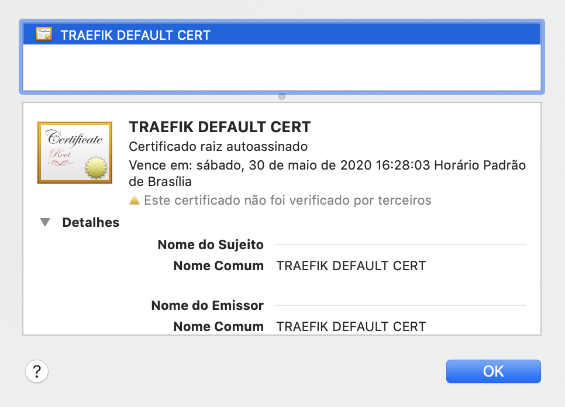

traefik study
===

Run it
---
edit yout /etc/hosts and add this line:

```
127.0.0.1  example.app
127.0.0.1  images.example.app
```

```bash
$ ./run.sh
```

open:

http://example.app:8080/dashboard/

Using ACME(Automatic Certificate Management Environment)
---

Acme is a https api to request certificates fom a <b>CA</b> using a json crontract.

If none of certificate is congured in traefik, a defauls selfsign root certificate is used.

Open https://images.example.app in a web browser and click in lock on left of address bar.




